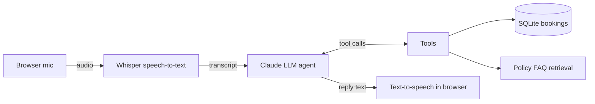

# ProctorPal: a voice AI agent for a campus testing center

ProctorPal answers student questions by voice and books, checks, and cancels exam slots end to end. It handles the repetitive front-desk requests that take staff time (hours, ID rules, make-up exams, bookings) and hands off to a human when it should.

## How it works



1. **Speech-to-text:** the browser records audio and the Flask backend transcribes it with Whisper (`faster-whisper`, running locally on CPU).
2. **LLM agent with tool use:** Claude decides when to look something up or take an action, using five tools: `search_policies`, `check_availability`, `book_slot`, `cancel_booking`, and `escalate_to_staff`.
3. **Retrieval-augmented generation:** policy answers come from a TF-IDF search over `data/faq.md`, so the agent answers from real policy text instead of guessing.
4. **Business rules in code, not the prompt:** 24-hour notice, 30-day window, Sunday closures, slot capacity, and duplicate bookings are enforced in `tools.py`, so the LLM can't book an invalid slot.
5. **Text-to-speech:** replies are spoken back with the browser's speech synthesis.
6. **Deployment:** Flask + Gunicorn in Docker, deployed on AWS EC2 by a GitHub Actions CI/CD pipeline that runs the tests first.

The web interface shows the live conversation, every tool call the agent makes, and the bookings table updating in real time.

## Project structure

| File | Purpose |
|---|---|
| `app.py` | Flask API: `/api/transcribe`, `/api/chat`, `/api/bookings`, `/health` |
| `agent.py` | Agent loop and system prompt tuned for spoken replies |
| `tools.py` | Tool functions, schemas, and booking rules |
| `knowledge.py` | Policy retrieval |
| `stt.py` | Whisper speech-to-text |
| `db.py` | SQLite storage |
| `templates/index.html` | Voice interface |
| `tests/` | 13 unit and API tests (no API key needed) |
| `eval/run_eval.py` | 10 scripted conversations against the real agent, with a pass rate |

## Run it locally

Requires Python 3.11+ and an Anthropic API key.

```bash
git clone https://github.com/MuskanDhaka515/proctorpal.git
cd proctorpal
python -m venv .venv && source .venv/bin/activate   # Windows: .venv\Scripts\activate
pip install -r requirements.txt
export ANTHROPIC_API_KEY=your-key-here                # Windows: set ANTHROPIC_API_KEY=...
python app.py
```

Open http://localhost:8000 in Chrome or Edge, allow the microphone, and press the mic button (or the space bar). The first voice request downloads the Whisper model, which takes about a minute once.

## Run with Docker

```bash
docker build -t proctorpal .
docker run -p 8000:8000 -e ANTHROPIC_API_KEY=your-key-here proctorpal
```

## Tests and evaluation

```bash
pytest -q                     # unit + API tests with a fake LLM
python eval/run_eval.py       # real conversations; prints "Result: X/10 scenarios passed"
```

## Deploy to AWS EC2

1. Launch an Ubuntu EC2 instance (t3.small or larger), open ports 22 and 80, and install Docker.
2. Clone this repo to `~/proctorpal` on the instance and create `~/proctorpal/.env` with `ANTHROPIC_API_KEY=...`.
3. In GitHub, add repository secrets `EC2_HOST`, `EC2_USER`, and `EC2_SSH_KEY`.
4. Push to `main`. GitHub Actions runs the tests, builds the image, and redeploys the container.

Browsers only allow microphone access on HTTPS or localhost, so for a public demo put the instance behind HTTPS (for example with Caddy or an AWS load balancer and certificate).

## Notes

The policy FAQ is sample data for a fictional testing center. Swap in your own `data/faq.md` to adapt the agent to another front desk.

## Next steps

- Phone calls through Twilio Voice
- Streaming responses to cut latency
- Calendar integration for staff schedules
